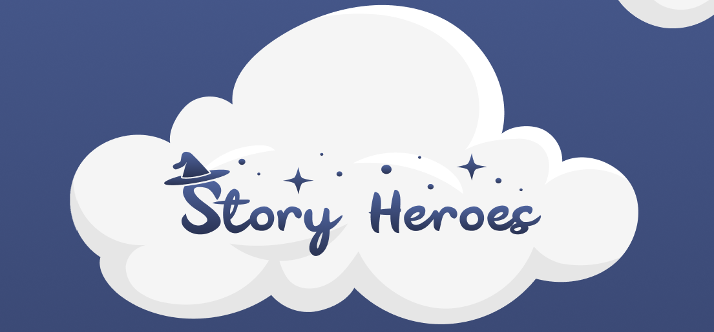

# Story-Heroes

**Story-Heroes** - это мобильное приложение, позволяющее в игровом формате сочинять сказки.
Основная миссия проекта - организация позитивного общения и совместного времяпрепровождения семьи.

## Установка
Скоро в открытом бесплатном доступе на Android PlayMarket! 
Ориентировочно - конец октября 2020г. 

## Документация
  - Документация на игру встроена в приложение и отображается игроку во время игры.
  - API на интеграцию с серсерной частью представлена в разделе wiki: [Ссылка](https://github.com/storytallers2020/StoryTallers2020/wiki/API)
  - Презентация приложения [Ссылка](https://drive.google.com/file/d/18P6bNSjD47sSN4RLomjxJYT3X7njozrR/view)
  
## Требования к системе
  - Телефон с ОС Android
  - Android API не ниже 21 (Jelly Bean)
  
## Стек технологий
  - Язык программирования Kotlin
  - Архитектура MVVM
  - DI - Koin
  - Навигация - Cicerone
  - Изображения - Glide
  - Реактивное программирование - RxJava3
  - Базы данных - Room
  - Сетевые запросы Retrofit
  - Material Design 
  - Amplitude
  
## Скриншоты приложения

